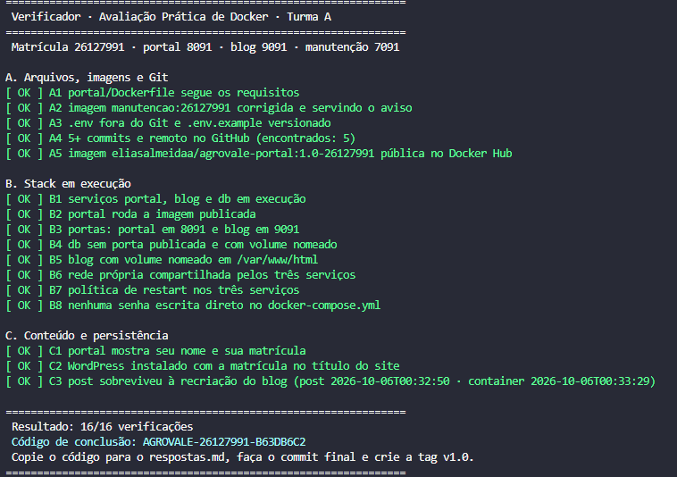

# Respostas · Avaliação Prática de Docker · Cooperativa AgroVale (Turma A)

Nome: Elias Martins de Almeida
Matrícula: 26127991
Usuário do GitHub: eliasalmeidaa
Usuário do Docker Hub: eliasalmeidaa

Responda com as suas palavras e com o que aconteceu na SUA máquina. Resposta curta e certa vale mais
do que texto longo copiado. Resposta que contradiz o seu próprio Dockerfile ou compose vale zero.

## Parte 1 · Dockerfile do portal

1. Qual imagem base você usou e qual o tamanho final da imagem do portal (saída de `docker images`)?

Usei `nginx:1.27-alpine`. A imagem `eliasalmeidaa/agrovale-portal:1.0-26127991` ficou com 73.6MB no `docker images`.

2. Em qual pasta do container o Nginx procura os arquivos do site? Mostre o comando que você usou para
   conferir que o `index.html` está lá dentro.

Na pasta `/usr/share/nginx/html`. Conferi com o container de teste rodando:
`docker exec teste-portal ls /usr/share/nginx/html`
A saída mostrou `50x.html`, `estilo.css` e `index.html`.

## Parte 2 · Docker Hub

3. Nome completo da imagem publicada e link público do repositório no Docker Hub.

Imagem: `eliasalmeidaa/agrovale-portal:1.0-26127991`
Link: https://hub.docker.com/r/eliasalmeidaa/agrovale-portal

4. Por que o `docker login` foi feito com um token de acesso e não com a senha da conta?

Porque o token tem permissão limitada (só Read & Write em repositórios), tem data de validade e pode ser revogado a qualquer momento sem trocar a senha da conta. Como o login foi feito num PC compartilhado do laboratório, se o token vazar eu apago só ele e a conta continua segura.

## Parte 3 · Página de manutenção

5. Preencha uma linha por defeito encontrado. Defeito inexistente listado aqui desconta pontos.

| # | Instrução | O que estava errado | O que você viu acontecer | Como corrigiu |
|---|---|---|---|---|
| 1 | `COPY` (ausente) | O Dockerfile não copiava o `site/index.html` para dentro da imagem | O container subia (Up no `docker ps`), sem erro no `docker logs`, mas o navegador mostrava "Welcome to nginx!" | Adicionei `COPY site/ .` |
| 2 | `WORKDIR /usr/share/nginx` | O diretório de trabalho apontava para a pasta acima da que o Nginx serve | `docker exec manut ls /usr/share/nginx` mostrou só a pasta `html`, com o index padrão do Nginx dentro | Mudei para `WORKDIR /usr/share/nginx/html` |
| 3 | | | | |

6. Qual a diferença entre `-p 7042:80` e `-p 80:7042` no `docker run`? Qual dos dois números é a porta do container?

O formato é `-p PORTA_DO_HOST:PORTA_DO_CONTAINER`. Em `-p 7042:80`, quem acessa a porta 7042 do meu computador chega na porta 80 do container, onde o Nginx escuta, então funciona. Em `-p 80:7042`, a porta 80 do host apontaria para a 7042 do container, onde nada está escutando, então não funcionaria. A porta do container é o número da direita.

## Parte 4 · docker-compose.yml

7. No serviço `blog`, por que `WORDPRESS_DB_HOST` recebe `db` e não `localhost`?

Porque cada container tem o seu próprio `localhost`. Dentro do container do WordPress, `localhost` é o próprio WordPress, onde não existe banco. Como os serviços estão na mesma rede (`rede_agrovale`), o Docker resolve o nome do serviço `db` para o IP do container do MariaDB.

8. Por que o serviço `db` não publica a porta 3306? Se precisar consultar o banco, como faz sem publicar
   a porta? Mostre o comando.

Porque só o WordPress precisa falar com o banco, e ele faz isso pela rede interna do compose. Publicar a 3306 deixaria o banco exposto para fora do host sem necessidade. No `docker compose ps`, o db aparece só como `3306/tcp`, sem `0.0.0.0`. Para consultar, entro no próprio container:
`docker compose exec db mariadb -u agrovale -p agrovale_blog`

## Parte 5 · Persistência

9. Quais comandos você usou para derrubar e subir a stack? Qual comando teria apagado o post que você criou,
   e por quê?

Usei `docker compose down` e depois `docker compose up -d`. O post continuou lá porque o banco e os arquivos do WordPress ficam nos volumes nomeados `agro_banco_dados` e `agro_blog_arquivos`, e o `down` remove só os containers e a rede. O comando que teria apagado o post é `docker compose down -v`, porque o `-v` remove também os volumes nomeados, apagando os dados do MariaDB.

10. Código de conclusão impresso pelo verificador:

```
CO Verificador · Avaliação Prática de Docker · Turma A                                                                                                                                                                       
================================================================
 Matrícula 26127991 · portal 8091 · blog 9091 · manutenção 7091

A. Arquivos, imagens e Git
[ OK ] A1 portal/Dockerfile segue os requisitos
[ OK ] A2 imagem manutencao:26127991 corrigida e servindo o aviso
[ OK ] A3 .env fora do Git e .env.example versionado
[ OK ] A4 5+ commits e remoto no GitHub (encontrados: 5)
[ OK ] A5 imagem eliasalmeidaa/agrovale-portal:1.0-26127991 pública no Docker Hub
                                                                                                                                                                                                                           B. Stack em execução                                                                                                                                                                                                       [ OK ] B1 serviços portal, blog e db em execução                                                                                                                                                                           [ OK ] B2 portal roda a imagem publicada                                                                                                                                                                                   [ OK ] B3 portas: portal em 8091 e blog em 9091                                                                                                                                                                            [ OK ] B4 db sem porta publicada e com volume nomeado                                                                                                                                                                      
[ OK ] B5 blog com volume nomeado em /var/www/html
[ OK ] B6 rede própria compartilhada pelos três serviços
[ OK ] B7 política de restart nos três serviços
[ OK ] B8 nenhuma senha escrita direto no docker-compose.yml

C. Conteúdo e persistência
[ OK ] C1 portal mostra seu nome e sua matrícula
[ OK ] C2 WordPress instalado com a matrícula no título do site
[ OK ] C3 post sobreviveu à recriação do blog (post 2026-10-06T00:32:50 · container 2026-10-06T00:33:29)

================================================================
 Resultado: 16/16 verificações
 Código de conclusão: AGROVALE-26127991-B63DB6C2
 Copie o código para o respostas.md, faça o commit final e crie a tag v1.0.
```


